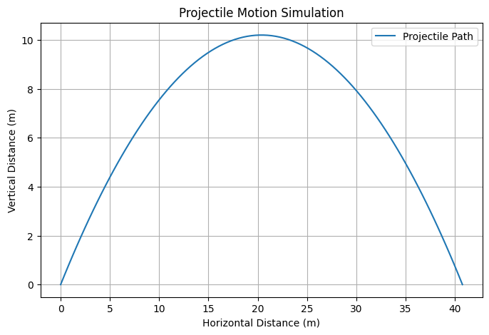

# Problem 1

**Investigating the Range as a Function of the Angle of Projection**

### **1. Theoretical Foundation**
Projectile motion follows the laws of classical mechanics and is governed by Newton’s equations of motion. We consider a projectile launched with an initial velocity $v_0$ at an angle $theta$ to the horizontal.

#### **Equations of Motion**
- Horizontal motion:

  $$x = v_0 \cos(\theta) t$$

- Vertical motion:
  \[ y = v_0 \sin(\theta) t - \frac{1}{2} g t^2 \]
  where \( g \) is the acceleration due to gravity.

To find the time of flight, we set \( y = 0 \) and solve for \( t \):
\[ t = \frac{2 v_0 \sin(\theta)}{g} \]

The horizontal range \( R \) is given by:
\[ R = v_0 \cos(\theta) \times \frac{2 v_0 \sin(\theta)}{g} \]
Using the trigonometric identity \( 2\sin(\theta)\cos(\theta) = \sin(2\theta) \), we get:
\[ R = \frac{v_0^2 \sin(2\theta)}{g} \]

This equation shows that the range depends on the initial velocity, gravitational acceleration, and angle of projection.

### **2. Analysis of the Range**
- The maximum range occurs at \( \theta = 45^\circ \), where \( \sin(2\theta) \) is maximized.
- Higher initial velocity \( v_0 \) results in a longer range.
- A stronger gravitational field \( g \) shortens the range.
- If the projectile is launched from an elevated height, the range extends due to additional time before impact.

### **3. Practical Applications**
- **Sports:** Calculating the optimal angle for throwing or kicking a ball.
- **Engineering:** Designing trajectories for ballistic missiles or rockets.
- **Gaming and Animation:** Simulating realistic projectile motion in video games.

### **4. Implementation**
To visualize the range as a function of the angle of projection, we can write a Python simulation using Matplotlib.

#### **Python Code for Simulation**
```python
import numpy as np
import matplotlib.pyplot as plt

def projectile_range(v0, g=9.81):
    angles = np.linspace(0, 90, 100)
    ranges = (v0**2 * np.sin(2 * np.radians(angles))) / g
    
    plt.figure(figsize=(8, 5))
    plt.plot(angles, ranges, label=f'Initial velocity = {v0} m/s')
    plt.xlabel('Launch Angle (degrees)')
    plt.ylabel('Range (m)')
    plt.title('Projectile Range as a Function of Angle')
    plt.legend()
    plt.grid()
    plt.show()

# Example usage
projectile_range(v0=20)
```

This code simulates how the range changes with the angle of projection for a given initial velocity.

---
This study demonstrates the dependence of projectile range on launch angle and other physical parameters, providing insights applicable in physics, engineering, and entertainment.


